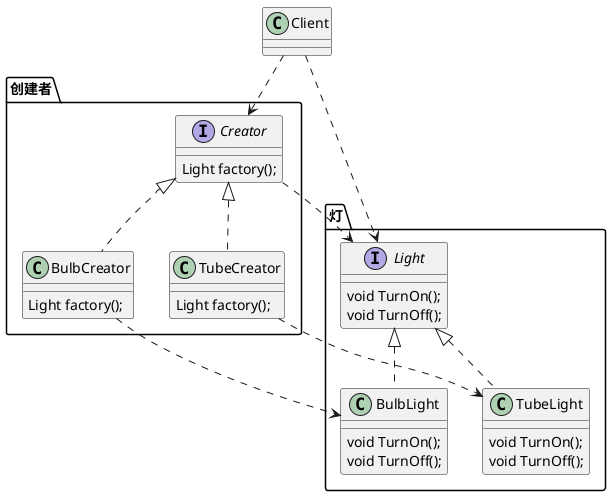

# 工厂模式

## 工厂的分类

### 简单工厂

#### 基本概念

也叫静态工厂方法，实现一个函数，通过参数的不同得到一个统一的接口对象。

对于C语言来说，也就是得到一个或者一组（数据结构封装）接口函数。

#### 应用场景

在业务实现过程中，把做什么的具体实现抽象成为一个接口函数（也就是这里的函数指针），通过简单工厂获取的这个接口函数。当接口函数增加或者删除时，我们业务实现的代码不需要做改变就能够完成新需求的变更，这也就是我们通常讲到的开闭原则。

我们的C语言代码经常用到一种方法叫做表驱动模式，这种设计方法的背后思想与我们常见的设计模式基本一致。

### 工厂方法

### 抽象工厂
