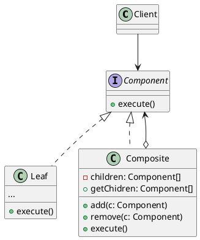

# 组合模式


组合模式屏蔽了叶节点和容器的区别，客户端可以用相同的接口来处理它们，并递归完成对整棵组合树的处理，使得客户端与容器内部结构解耦

```C
struct Component {
    struct Component **childComps; // 子节点指针数组，叶节点时值为NULL
    int number;                    // 包含的子节点个数，叶节点时值为0
    void (*operate)(struct Component* comp); // 针对此节点的处理函数
}

// 非叶节点的operate函数
void ParentOperate(struct Component* comp)
{
    for (int i = 0; i < comp->number; i++) {
        comp->childComps[i]->operate(comp->childComps[i]);
    }
}

// 叶节点的operate函数
void ChildOperate(struct Component* comp)
{
    printf("child node!\n");
}

// 整个树的处理函数
void Process(struct Component* comp)
{
    comp->operate(comp);
}
```
