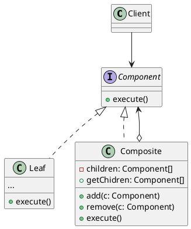

# 组合模式

```plantuml
@startuml 组合模式

class Client {

}

interface Component {
    + execute()
}

class Leaf {
    ...
    + execute()
}

class Composite {
    - children: Component[]
    + add(c: Component)
    + remove(c: Component)
    + getChidren: Component[]
    + execute()
}

Client --> Component
Component <|.. Leaf
Component <|.. Composite
Component <--o Composite

@enduml
```
组合模式屏蔽了叶节点和容器的区别，客户端可以用相同的接口来处理它们，并递归完成对整棵组合树的处理，使得客户端与容器内部结构解耦
