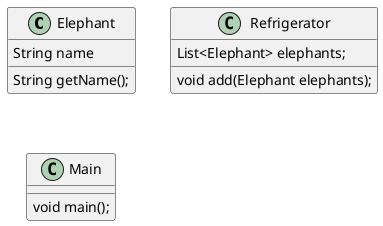

# 单例模式

一个类有且仅有一个实例对象

```plantuml

@startuml

class Elephant {
    String name
    String getName();
}

class Refrigerator {
    List<Elephant> elephants;
    void add(Elephant elephants);
}

class Main {
    void main();    
}

@enduml

```
