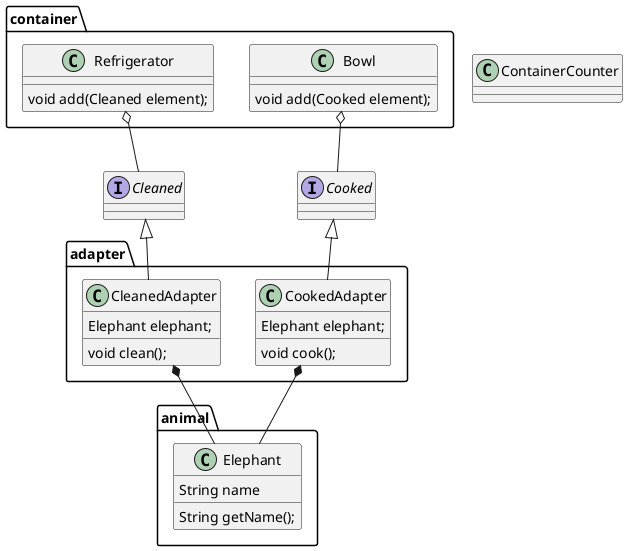

# 适配器模式

使用一个“中间者”来帮助我们来做不兼容的转换

```plantuml
@startuml adapter

package container {
    class Refrigerator {
        void add(Cleaned element);
    }

    class Bowl {
        void add(Cooked element);    
    }
}

interface Cooked
interface Cleaned

Refrigerator o-- Cleaned
Bowl o-- Cooked

package animal {
    class Elephant {
        String name
        String getName();
    }
}

package adapter {
    class CookedAdapter {
        Elephant elephant;
        void cook();
    }
    class CleanedAdapter {
        Elephant elephant;
        void clean();    
    }     
}

CookedAdapter *-- Elephant
CleanedAdapter *-- Elephant

Cooked <|-- CookedAdapter
Cleaned <|-- CleanedAdapter

class ContainerCounter

@enduml
```
