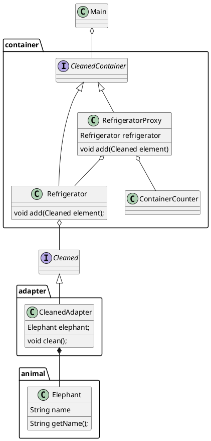

# 代理模式

使用一个“中间者”来帮助我们来控制对某对象的访问

```plantuml
@startuml adapter

package container {
    class ContainerCounter
    interface CleanedContainer
    class Refrigerator {
        void add(Cleaned element);
    }
    CleanedContainer <|-- Refrigerator
    class RefrigeratorProxy {
        Refrigerator refrigerator
        void add(Cleaned element)
    }
    CleanedContainer <|-- RefrigeratorProxy
    RefrigeratorProxy o-- Refrigerator
    RefrigeratorProxy o-- ContainerCounter
}

class Main

Main o-- CleanedContainer

interface Cleaned

Refrigerator o-- Cleaned

package animal {
    class Elephant {
        String name
        String getName();
    }
}

package adapter {
    class CleanedAdapter {
        Elephant elephant;
        void clean();    
    }     
}

CleanedAdapter *-- Elephant

Cleaned <|-- CleanedAdapter

@enduml
```
